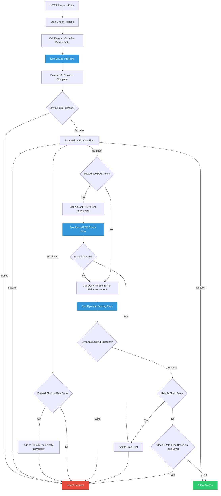
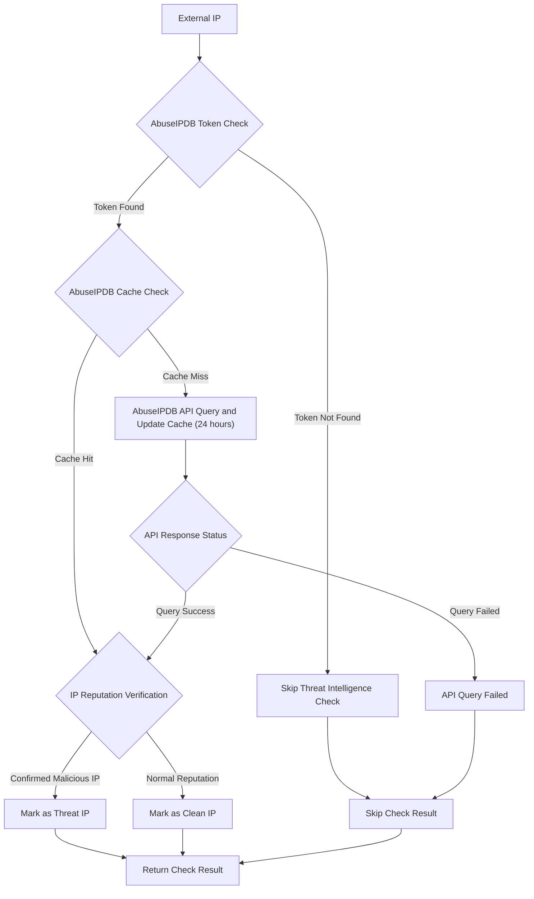

```mermaid
graph TD
  A[HTTP Request Received] --> B[getDevice Extract Device Info]
  
  B --> C[r.UserAgent Get User-Agent]
  C --> D[getClientIP IP Address Resolution]
  
  D --> E[Check Proxy Header Priority]
  E --> F1[CF-Connecting-IP Cloudflare]
  E --> F2[X-Forwarded-For Standard Reverse Proxy]
  E --> F3[X-Real-IP Nginx]
  E --> F4[X-Client-IP Apache]
  E --> F5[Other Proxy Headers]
  
  F1 --> G[Parse and Validate IP Format]
  F2 --> G
  F3 --> G
  F4 --> G
  F5 --> G
  
  G --> H{Valid Proxy IP?}
  H -->|No| I[Use RemoteAddr]
  H -->|Yes| J[isInternalIP Internal Network Check]
  I --> J
  
  J --> K[hasProxyHeader Proxy Header Check]
  K --> L{Has Proxy Header?}
  L -->|Yes| M[checkProxy Proxy Chain Validation]
  L -->|No| N[Direct IP Internal Network Check]
  
  M --> O[isInternalIPRange CIDR Check]
  N --> O
  O --> P[Set isPrivate and ipTrustLevel]
  
  P --> Q[User-Agent Parsing Flow]
  Q --> R[getPlatform Platform Identification]
  R --> S[getBrowser Browser Identification]
  S --> T[getType Device Type Identification]
  T --> U[getOS Operating System Identification]
  
  U --> V[Create Basic Device Structure]
  V --> W[Manager Status Check]
  W --> X[Trust.check Trust List Check]
  X --> Y[Ban.check Block List Check]
  Y --> Z[Block.check Block List Check]
  
  Z --> AA[requestCountInMin Minute Request Count]
  AA --> BB[blockCountInHour Hour Block Count]
  
  BB --> CC[getSessionID Session Management]
  CC --> DD{Session Cookie Exists?}
  
  DD -->|Yes| EE[parseSignedSessionID Parse Signature]
  EE --> FF{HMAC-SHA256 Signature Valid?}
  FF -->|Yes| GG[Extend Cookie 30 Days]
  FF -->|No| HH[createSignedSessionID Create New Session]
  
  DD -->|No| HH
  HH --> II[generateSessionID Generate 32 Character ID]
  II --> JJ[signSessionID HMAC Signature]
  JJ --> KK[Format: s:sessionID.signature]
  KK --> LL[Set 30 Day HttpOnly Cookie]
  
  GG --> MM[getFingerprint Device Fingerprint Generation]
  LL --> MM
  
  MM --> NN{Device Cookie Exists?}
  NN -->|Yes| OO[Read Existing Device Key]
  NN -->|No| PP[uuid Generate 128 Character Random Key]
  
  OO --> QQ[Extend Cookie 365 Days]
  PP --> RR[Set 365 Day HttpOnly Cookie]
  
  QQ --> SS[Create Fingerprint Info String]
  RR --> SS
  SS --> TT[Platform/Browser/Type/OS/Key]
  TT --> UU[SHA256 Hash Calculation]
  UU --> VV[hex.EncodeToString Fingerprint Generation]
  
  VV --> WW[Return Complete Device Structure]
  
  subgraph "IP Address Resolution & Proxy Detection"
  D
  E
  F1
  F2
  F3
  F4
  F5
  G
  H
  I
  J
  K
  L
  M
  N
  O
  P
  end
  
  subgraph "User-Agent Parsing Engine"
  Q
  R
  S
  T
  U
  end
  
  subgraph "Security Status Check"
  W
  X
  Y
  Z
  AA
  BB
  end
  
  subgraph "Session Management (30 Day Sliding Window)"
  CC
  DD
  EE
  FF
  GG
  HH
  II
  JJ
  KK
  LL
  end
  
  subgraph "Device Fingerprint Tracking (365 Day Sliding Window)"
  MM
  NN
  OO
  PP
  QQ
  RR
  SS
  TT
  UU
  VV
  end
  
  classDef success fill:#2ecc71,stroke:#27ae60,color:#ffffff
  
  class WW success
  class X,Y,Z security
  class R,S,T,U process
  class II,JJ,UU,VV crypto
```

# IP Guardian - IP security protection

> IP Guardian is a high-performance IP security protection system developed in Go, providing real-time threat detection, dynamic risk scoring, device fingerprinting, and multi-layered security mechanisms. The system uses Redis as a high-speed cache layer, supporting concurrent processing and automated threat response.

[](https://github.com/pardnchiu/golang-ip-guardian/releases)

## Key Features

### Multi-Layered Security Protection
- **Whitelist Management**: Trusted list automatically bypasses security checks with file synchronization
- **Blacklist System**: Permanently blocks malicious IPs with integrated email notifications
- **Dynamic Blocking**: Temporarily blocks suspicious activities with exponential time growth
- **Auto-Escalation**: Repeated blocks automatically escalate to permanent bans

### Intelligent Threat Detection
- **Device Fingerprinting**: SHA256-encrypted unique device identification with 365-day tracking
- **Behavioral Analysis**: Request patterns, time intervals, and session tracking
- **Geolocation Monitoring**: Cross-country jumping, rapid location changes, high-risk region detection
- **Correlation Analysis**: Multi-device, multi-IP, multi-session anomaly detection
- **Login Behavior**: Login failure count and 404 error frequency monitoring

### High-Performance Architecture
- **Concurrent Processing**: Parallel risk assessment with 4 simultaneous Goroutines
- **Redis Caching**: Millisecond-level query response with 24-hour geolocation cache
- **Pipeline Batching**: Reduced network latency with optimized Redis operations
- **Memory Optimization**: Local cache and Redis dual-layer architecture
- **HMAC Signatures**: Secure session ID validation

### Dynamic Scoring System
- **Real-time Calculation**: Multi-dimensional risk factor parallel computation
- **Adaptive Adjustment**: Dynamic rate limiting based on threat levels
- **Threshold Management**: Suspicious, dangerous, and blocking three-tier classification
- **Auto Rate Limiting**: Normal(100), Suspicious(50), Dangerous(20) three-tier limits

## System Architecture

### Core Components

#### IPGuardian Main Instance
- Manages Redis connections, logging, and configuration parameters
- Coordinates Trust, Ban, and Block sub-managers
- Provides device checking and risk scoring functionality
- Supports GeoLite2 geolocation detection

#### Trust Manager (Whitelist)
- Maintains trusted IP list
- Supports memory cache and Redis persistence
- File synchronization to `trust_list.json`
- Supports tag-based categorization

#### Ban Manager (Blacklist)
- Manages permanently blocked IP addresses
- Provides SMTP email notification functionality
- File synchronization to `ban_list.json`
- Records blocking reasons and timestamps

#### Block Manager (Temporary Blocking)
- Implements exponential growth blocking time mechanism (1<<count)
- Automatic blocking count tracking
- Auto-transfers to blacklist when threshold exceeded
- Supports maximum blocking time limits

### Device Detection Mechanism

#### IP Resolution Mechanism
Supports multiple Proxy Header checks in priority order:
1. `CF-Connecting-IP` (Cloudflare)
2. `X-Forwarded-For` (Standard reverse proxy)
3. `X-Real-IP` (Nginx)
4. `X-Client-IP` (Apache)
5. `X-Cluster-Client-IP` (Cluster)
6. `X-Forwarded`, `Forwarded-For`, `Forwarded`

Automatically identifies internal/external IPs, supporting these internal ranges:
- `10.0.0.0/8`, `172.16.0.0/12`, `192.168.0.0/16`
- `127.0.0.0/8`, `169.254.0.0/16`
- `::1/128`, `fc00::/7`

#### Device Fingerprint Identification
- SHA256 fingerprint based on Platform/Browser/OS/128-character UUID
- HMAC-SHA256 signed Session ID
- HttpOnly Secure Cookie protection against XSS attacks
- Supports SameSite=Strict mode

### Risk Scoring System

#### Basic Checks (calcBasic)
- **Session Multi-IP Check**: Single session using multiple IPs
- **IP Multi-Device Check**: Single IP corresponding to multiple device fingerprints
- **Device Multi-IP Check**: Single device using multiple IPs
- **Login Failure Monitoring**: Records failure count, triggers risk when threshold exceeded
- **404 Error Tracking**: Monitors abnormal path probing behavior

#### Geolocation Analysis (calcGeo)
- **High-Risk Countries**: Configurable high-risk region list
- **Geographic Jumping**: More than 4 countries within 1 hour triggers alert
- **Frequent Switching**: City switching more than 4 times within 1 hour
- **Rapid Changes**: Movement speed exceeding 800 km/h or crossing 500 km within 30 minutes
- **Distance Calculation**: Uses Haversine formula to calculate Earth surface distance

#### Behavioral Analysis (calcBehavior)
- **Request Interval Regularity Detection**: Variance < 1000 with regular intervals
- **Long Connection Time Monitoring**: Tiered alerts for exceeding 1/2/4 hours
- **Frequent Request Pattern Recognition**: More than 16 requests within 500ms
- **Extreme Regularity Detection**: Variance < 100 with samples ≥ 8

#### Fingerprint Analysis (calcFingerprint)
- **Same Fingerprint Multi-Session Detection**: Single fingerprint with more than 2 sessions within 1 minute
- **Minute-Level Statistics Protection**: Uses timestamp segmentation to avoid false positives

### Middleware Integration

#### Gin Framework
```go
router.Use(guardian.GinMiddleware())
```
- Automatic JSON error responses
- Complete HTTP status code support
- Supports `c.Abort()` request interruption

#### Standard HTTP
```go
http.Handle("/", guardian.HTTPMiddleware(yourHandler))
```
- Handler wrapper pattern
- Standard HTTP response format
- Complete error handling mechanism

## Configuration Parameters

### File Path Configuration
```go
type Filepath struct {
  CityDB    string `json:"city_db"`    // GeoLite2-City.mmdb
  CountryDB string `json:"country_db"` // GeoLite2-Country.mmdb
  TrustList string `json:"trust_list"` // trust_list.json
  BanList   string `json:"ban_list"`   // ban_list.json
}
```

### Core Parameters

```go
type Parameter struct {
  HighRiskCountry        []string `json:"high_risk_country"`         // High-risk country list
  BlockToBan             int      `json:"block_to_ban"`              // Block to ban threshold count
  BlockTimeMin           int      `json:"block_time_min"`            // Minimum block time (seconds)
  BlockTimeMax           int      `json:"block_time_max"`            // Maximum block time (seconds)
  RateLimitNormal        int      `json:"rate_limit_normal"`         // Normal request rate limit
  RateLimitSuspicious    int      `json:"rate_limit_suspicious"`     // Suspicious request rate limit
  RateLimitDangerous     int      `json:"rate_limit_dangerous"`      // Dangerous request rate limit
  SessionMultiIP         int      `json:"session_multi_ip"`          // Max IPs per session
  IPMultiDevice          int      `json:"ip_multi_device"`           // Max devices per IP
  DeviceMultiIP          int      `json:"device_multi_ip"`           // Max IPs per device
  LoginFailure           int      `json:"login_failure"`             // Max login failures per session
  NotFound404            int      `json:"not_found_404"`             // Max 404 requests per session
  ScoreNormal            int      `json:"score_normal"`              // Normal request risk score
  ScoreSuspicious        int      `json:"score_suspicious"`          // Suspicious request threshold
  ScoreDangerous         int      `json:"score_dangerous"`           // Dangerous request threshold
  ScoreSessionMultiIP    int      `json:"score_session_multi_ip"`    // Session multi-IP risk score
  ScoreIPMultiDevice     int      `json:"score_ip_multi_device"`     // IP multi-device risk score
  ScoreDeviceMultiIP     int      `json:"score_device_multi_ip"`     // Device multi-IP risk score
  ScoreFpMultiSession    int      `json:"score_fp_multi_session"`    // Fingerprint multi-session risk score
  ScoreGeoHighRisk       int      `json:"score_geo_high_risk"`       // High-risk geolocation score
  ScoreGeoHopping        int      `json:"score_geo_hopping"`         // Geographic hopping score
  ScoreGeoFrequentSwitch int      `json:"score_geo_frequent_switch"` // Frequent location switch score
  ScoreGeoRapidChange    int      `json:"score_geo_rapid_change"`    // Rapid location change score
  ScoreIntervalRequest   int      `json:"score_interval_request"`    // Short interval request score
  ScoreFrequencyRequest  int      `json:"score_frequency_request"`   // Request frequency score
  ScoreLongConnection    int      `json:"score_long_connection"`     // Long connection score
  ScoreLoginFailure      int      `json:"score_login_failure"`       // Login failure score
  ScoreNotFound404       int      `json:"score_not_found_404"`       // 404 request score
}
```

## API Reference

### Public Methods

#### Initialization
```go
guardian, err := golangIPGuardian.New(&golangIPGuardian.Config{
  Redis: golangIPGuardian.Redis{
    Host: "localhost",
    Port: 6379,
  },
  // Other configurations...
})
```

#### Main Check
```go
result := guardian.Check(r, w)
if !result.Success {
  // Handle blocked requests
  log.Printf("Request blocked: %s", result.Error)
}
```

#### Manual Management
```go
// Add to trust list
guardian.Manager.Trust.Add("192.168.1.100", "Internal server")

// Add to ban list
guardian.Manager.Ban.Add("1.2.3.4", "Malicious attack")

// Add to block list
guardian.Manager.Block.Add("5.6.7.8", "Suspicious behavior")

// Record login failure
guardian.LoginFailure(w, r)

// Record 404 error
guardian.NotFound404(w, r)
```

## File Formats

### trust_list.json
```json
[
  {
  "ip": "192.168.1.100",
  "tag": "Internal server",
  "added_at": 1703980800
  }
]
```

### ban_list.json
```json
[
  {
  "ip": "1.2.3.4",
  "reason": "Malicious attack",
  "added_at": 1703980800
  }
]
```

## Performance Features

### Redis Optimization
- Uses Pipeline batch operations to reduce network latency
- Automatic expiration time settings to prevent memory leaks
- Dual-layer cache architecture: Local memory + Redis

### Concurrent Processing
- 4 Goroutines executing risk assessment in parallel
- Mutex protection for shared resources
- Unified error channel for exception handling

### Memory Management
- Local cache reduces Redis queries
- Periodic cleanup of expired data
- Minimized memory allocation

## Security Features

### Session Security
- HMAC-SHA256 signature verification
- HttpOnly Cookie prevents XSS
- SameSite=Strict prevents CSRF
- 30-day sliding window updates

### Device Tracking
- SHA256 fingerprint hashing
- 365-day long-term tracking
- 128-character random keys
- Prevents fingerprint spoofing

## System Architecture

<details>
<summary>Main Flow</summary>



</details>

<details>
<summary>Device Info</summary>



</details>

<details>
<summary>AbuseIPDB (Not Implemented)</summary>



</details>

<details>
<summary>Dynamic Scoring</summary>


</details>

## License

This source code project is licensed under the [MIT](https://github.com/pardnchiu/FlexPlyr/blob/main/LICENSE) license.

## Creator


<h4 style="padding-top: 0">邱敬幃 Pardn Chiu</h4>

<a href="mailto:dev@pardn.io" target="_blank">
  
</a> <a href="https://linkedin.com/in/pardnchiu" target="_blank">
  
</a>

***

©️ 2025 [邱敬幃 Pardn Chiu](https://pardn.io)
