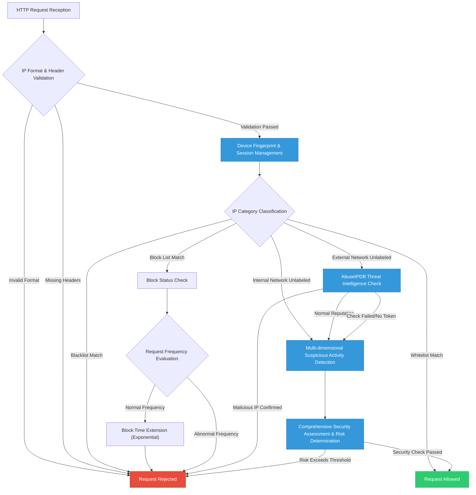
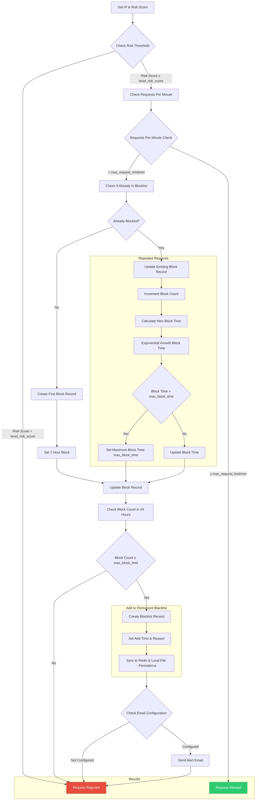

# IP Guardian

## Main Flow

```mermaid
flowchart TD
  A["HTTP Request Reception"] --> V1{"IP Format & Header Validation"}
  V1 -->|"Invalid Format"| Y["Request Rejected"]:::danger
  V1 -->|"Missing Headers"| Y
  V1 -->|"Validation Passed"| DEVICE_INFO["Device Fingerprint & Session Management"]:::module
  
  DEVICE_INFO --> L{"IP Category Classification"}
  L -->|"Block List Match"| BT["Block Status Check"]
  L -->|"Internal Network Unlabeled"| DYNAMIC_SCORE
  L -->|"External Network Unlabeled"| ABUSE_CHECK["AbuseIPDB Threat Intelligence Check"]:::module
  L -->|"Whitelist Match"| Z_ALLOW["Request Allowed"]:::success
  L -->|"Blacklist Match"| Y
  
  BT --> BD{"Request Frequency Evaluation"}
  BD -->|"Normal Frequency"| BF["Block Time Extension (Exponential)"] --> Y
  BD -->|"Abnormal Frequency"| Y
  
  ABUSE_CHECK -->|"Malicious IP Confirmed"| Y
  ABUSE_CHECK -->|"Normal Reputation"| DYNAMIC_SCORE
  ABUSE_CHECK -->|"Check Failed/No Token"| DYNAMIC_SCORE
  
  DYNAMIC_SCORE["Multi-dimensional Suspicious Activity Detection"]:::module --> SECURE_RESULT["Comprehensive Security Assessment & Risk Determination"]:::module
  
  SECURE_RESULT -->|"Security Check Passed"| Z_ALLOW
  SECURE_RESULT -->|"Risk Exceeds Threshold"| Y
  
  classDef success fill:#2ecc71,stroke:#27ae60,color:#ffffff
  classDef danger fill:#e74c3c,stroke:#c0392b,color:#ffffff
  classDef module fill:#3498db,stroke:#2980b9,color:#ffffff
  
  class A,V1,L main
```

## Device Info

```mermaid
graph TD
    A[HTTP Request Reception] --> B[getDevice Extract Device Information]
    
    B --> C[r.UserAgent Get User-Agent]
    C --> D[getClientIP IP Address Resolution]
    
    D --> E[Check Proxy Header Priority]
    E --> F1[CF-Connecting-IP Cloudflare]
    E --> F2[X-Forwarded-For Standard Reverse Proxy]
    E --> F3[X-Real-IP Nginx]
    E --> F4[X-Client-IP Apache]
    E --> F5[Other Proxy Headers]
    
    F1 --> G[Parse and Validate IP Format]
    F2 --> G
    F3 --> G
    F4 --> G
    F5 --> G
    
    G --> H{Valid Proxy IP?}
    H -->|No| I[Use RemoteAddr]
    H -->|Yes| J[isInternalIP Internal Network Check]
    I --> J
    
    J --> K[hasProxyHeader Proxy Header Check]
    K --> L{Has Proxy Header?}
    L -->|Yes| M[checkProxy Proxy Chain Validation]
    L -->|No| N[Direct IP Internal Network Check]
    
    M --> O[isInternalIPRange CIDR Check]
    N --> O
    O --> P[Set isPrivate and ipTrustLevel]
    
    P --> Q[User-Agent Parsing Process]
    Q --> R[getPlatform Platform Identification]
    R --> S[getBrowser Browser Identification]
    S --> T[getType Device Type Identification]
    T --> U[getOS Operating System Identification]
    
    U --> V[Build Base Device Structure]
    V --> W[Manager Status Check]
    W --> X[Trust.check Trust List Check]
    X --> Y[Ban.check Ban List Check]
    Y --> Z[Block.check Block List Check]
    
    Z --> AA[requestCountInMin Minute Request Count]
    AA --> BB[blockCountInHour Hour Block Count]
    
    BB --> CC[getSessionID Session Management]
    CC --> DD{Session Cookie Exists?}
    
    DD -->|Yes| EE[parseSignedSessionID Parse Signature]
    EE --> FF{HMAC-SHA256 Signature Valid?}
    FF -->|Yes| GG[Extend Cookie 30 Days]
    FF -->|No| HH[createSignedSessionID Create New Session]
    
    DD -->|No| HH
    HH --> II[generateSessionID Generate 32-char ID]
    II --> JJ[signSessionID HMAC Signature]
    JJ --> KK[Format: s:sessionID.signature]
    KK --> LL[Set 30-day HttpOnly Cookie]
    
    GG --> MM[getFingerprint Device Fingerprint Generation]
    LL --> MM
    
    MM --> NN{Device Cookie Exists?}
    NN -->|Yes| OO[Read Existing Device Key]
    NN -->|No| PP[uuid Generate 128-char Random Key]
    
    OO --> QQ[Extend Cookie 365 Days]
    PP --> RR[Set 365-day HttpOnly Cookie]
    
    QQ --> SS[Build Fingerprint Information String]
    RR --> SS
    SS --> TT[Platform/Browser/Type/OS/Key]
    TT --> UU[SHA256 Hash Calculation]
    UU --> VV[hex.EncodeToString Fingerprint Generation]
    
    VV --> WW[Return Complete Device Structure]
    
    subgraph "IP Address Resolution & Proxy Detection"
        D
        E
        F1
        F2
        F3
        F4
        F5
        G
        H
        I
        J
        K
        L
        M
        N
        O
        P
    end
    
    subgraph "User-Agent Parsing Engine"
        Q
        R
        S
        T
        U
    end
    
    subgraph "Security Status Check"
        W
        X
        Y
        Z
        AA
        BB
    end
    
    subgraph "Session Management (30-day Sliding Window)"
        CC
        DD
        EE
        FF
        GG
        HH
        II
        JJ
        KK
        LL
    end
    
    subgraph "Device Fingerprint Tracking (365-day Sliding Window)"
        MM
        NN
        OO
        PP
        QQ
        RR
        SS
        TT
        UU
        VV
    end
    
    classDef success fill:#2ecc71,stroke:#27ae60,color:#ffffff
    
    class WW success
    class X,Y,Z security
    class R,S,T,U process
    class II,JJ,UU,VV crypto
```

### AbuseIPDB Check

```mermaid
flowchart TD
  START["External IP"] --> TOKEN{"AbuseIPDB Token Check"}
  
  TOKEN -->|"Token Not Found"| NO_TOKEN["Skip Threat Intelligence Check"]
  TOKEN -->|"Token Found"| CACHE{"AbuseIPDB Cache Check"}
  
  CACHE -->|"Cache Hit"| REPUTATION{"IP Reputation Validation"}
  CACHE -->|"Cache Miss"| API_QUERY["AbuseIPDB API Query & Cache Update (24h)"]
  
  API_QUERY --> API_STATUS{"API Response Status"}
  API_STATUS -->|"Query Failed"| API_FAIL["API Query Failed"]
  API_STATUS -->|"Query Successful"| REPUTATION
  
  REPUTATION -->|"Malicious IP Confirmed"| MALICIOUS["Mark as Threat IP"]
  REPUTATION -->|"Normal Reputation"| CLEAN["Mark as Clean IP"]
  
  NO_TOKEN --> SKIP["Skip Check Result"]
  API_FAIL --> SKIP
  MALICIOUS --> RESULT["Return Check Result"]
  CLEAN --> RESULT
  SKIP --> RESULT
```

## Dynamic Score

```mermaid
graph TD
    A[Start Dynamic Score Calculation dynamicScore] --> B[Initialize Parallel Execution Environment]
    B --> C[Create WaitGroup, Mutex, errChan]
    C --> D[Initialize Shared Results: combinedFlags, combinedScore]
    
    D --> E[Launch Four Goroutines Simultaneously]
    
    E --> |wg.Add| I1[Define BasicItem Operations Matrix]
    E --> |wg.Add| I2{GeoChecker & DB Available?}
    E --> |wg.Add| I3[Redis Pipeline Get Interval Data]
    E --> |wg.Add| I4[Calculate Current Minute Timestamp]
    
    I1 --> J1[Redis Pipeline Batch Operations]
    J1 --> K1[SAdd + SCard + Expire Correlation Analysis]
    K1 --> L1[Threshold Decision: count > threshold * 1.5]
    L1 --> M1[Generate localFlags, localScore]
    M1 --> N1[mu.Lock Safe Result Merge]
    
    I2 -->|No| J2[return nil Skip Detection]
    I2 -->|Yes| K2[net.ParseIP Address Parsing]
    K2 --> L2[GeoIP2 Country Query]
    L2 --> M2[Redis LPUSH Location History]
    M2 --> N2[Analyze 1-Hour Location Changes]
    N2 --> O2[Detect Geo Hopping/Switching/Rapid Change]
    O2 --> P2[mu.Lock Safe Result Merge]
    J2 --> P2
    
    I3 --> J3[Calculate Request Time Intervals]
    J3 --> K3[Statistical Analysis: Average, Variance]
    K3 --> L3[Detect Regularity, Frequent Requests, Extreme Patterns]
    L3 --> M3[Session Duration Tiered Detection]
    M3 --> N3[mu.Lock Safe Result Merge]
    
    I4 --> J4[Redis SADD Fingerprint-Session Association]
    J4 --> K4[Redis SCARD Count Session Numbers]
    K4 --> L4{sessionCount > 2?}
    L4 -->|Yes| M4[Mark fp_multi_session]
    L4 -->|No| N4[No Anomaly Marked]
    M4 --> O4[mu.Lock Safe Result Merge]
    N4 --> O4
    
    N1 --> Q[wg.Done Completion Notification]
    P2 --> Q
    N3 --> Q
    O4 --> Q
    
    Q --> R[wg.Wait All Goroutines Complete]
    R --> S[close errChan Error Channel]
    S --> T[range errChan Check Errors]
    T --> U{Any Errors?}
    U -->|Yes| KK
    U -->|No| W[calcScore Calculate Final Risk]
    
    W --> X[Combination Risk Detection: Detail > 4]
    X --> Y[math.Min Score Cap at 100]
    Y --> Z{totalRisk > 100?}
    Z -->|Yes| AA[Manager.Block.Add Auto Block]
    Z -->|No| BB[Risk Level Classification]
    
    AA --> CC[IsBlock: true]
    
    BB --> DD[Build ScoreItem Structure]
    DD --> EE[IsBlock: totalRisk >= 100]
    EE --> FF[IsSuspicious: totalRisk >= ScoreSuspicious]
    FF --> GG[IsDangerous: totalRisk >= ScoreDangerous]
    GG --> HH[Flag: combinedFlags]
    HH --> II[Score: totalRisk]
    II --> JJ[Detail: combinedScore.Detail]
    
    JJ --> KK[Return Complete ScoreItem]:::success
    CC --> KK
    
    subgraph "Parallel Goroutine Execution Groups"
        subgraph "calcBasic: Basic Correlation Detection"
            I1
            J1
            K1
            L1
            M1
            N1
        end
        
        subgraph "calcGeo: Geographic Location Analysis"
            I2
            J2
            K2
            L2
            M2
            N2
            O2
            P2
        end
        
        subgraph "calcBehavior: Time Pattern Analysis"
            I3
            J3
            K3
            L3
            M3
            N3
        end
        
        subgraph "calcFingerprint: Fingerprint Correlation"
            I4
            J4
            K4
            L4
            M4
            N4
            O4
        end
    end
    
    subgraph "Synchronization Control & Error Handling"
        Q
        R
        S
        T
        U
    end
    
    subgraph "Final Risk Assessment & Result Construction"
        W
        X
        Y
        Z
        AA
        BB
        CC
        DD
        EE
        FF
        GG
        HH
        II
        JJ
        KK
    end
    
    classDef success fill:#2ecc71,stroke:#27ae60,color:#ffffff
    
    class I1,I2,I3,I4 parallel
    class Q,R,S,T sync
    class J1,J3,J4,K1,K2,K3,K4 calc
```

## Risk Determination

```mermaid
flowchart TD

    B[Get IP & Risk Score] --> C{Check Risk Threshold}
    
    C -->|"Risk Score > level_risk_score"| REJECT
    C -->|"Risk Score ≤ level_risk_score"| D[Check Requests Per Minute]
    
    D --> E{Requests Per Minute Check}
    E -->|"≤ max_request_limit/min"| ALLOW
    E -->|"> max_request_limit/min"| G[Check If Already in Blocklist]
    
    G --> H{Already Blocked?}
    
    H -->|"No"| I[Create First Block Record]
    H -->|"Yes"| J[Update Existing Block Record]
    

    subgraph "Repeated Requests"
      J --> L[Increment Block Count]
      L --> M[Calculate New Block Time]
      M --> N[Exponential Growth Block Time]
      N --> O{Block Time > max_block_time}
      O -->|"Yes"| P[Set Maximum Block Time max_block_time]
      O -->|"No"| Q[Update Block Time]
    end

      I --> K[Set 1 Hour Block]
    
    K --> R[Update Block Record]
    P --> R
    Q --> R
    
    R --> S[Check Block Count in 24 Hours]
    S --> T{Block Count ≥ max_block_limit}
    
    T -->|"No"| REJECT
    T -->|"Yes"| Y
    
    subgraph "Add to Permanent Blacklist"
      Y[Create Blacklist Record] --> AA[Set Add Time & Reason]
      AA --> BB[Sync to Redis & Local File - Persistence]
    end
    
    BB --> CC{Check Email Configuration}
    CC -->|"Configured"| FF[Send Alert Email]
    CC -->|"Not Configured"| REJECT

      FF --> REJECT
    
    subgraph "Results"
      ALLOW[Request Allowed]:::success
      REJECT[Request Rejected]:::danger
    end
    
    classDef success fill:#2ecc71,stroke:#27ae60,color:#ffffff
    classDef danger fill:#e74c3c,stroke:#c0392b,color:#ffffff
```