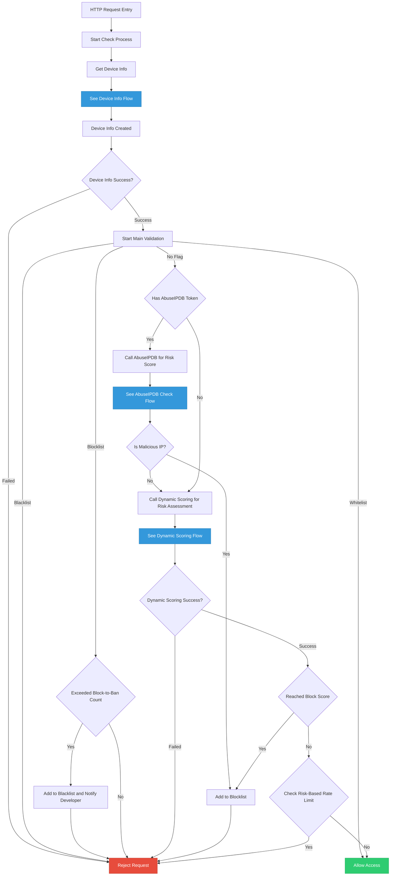
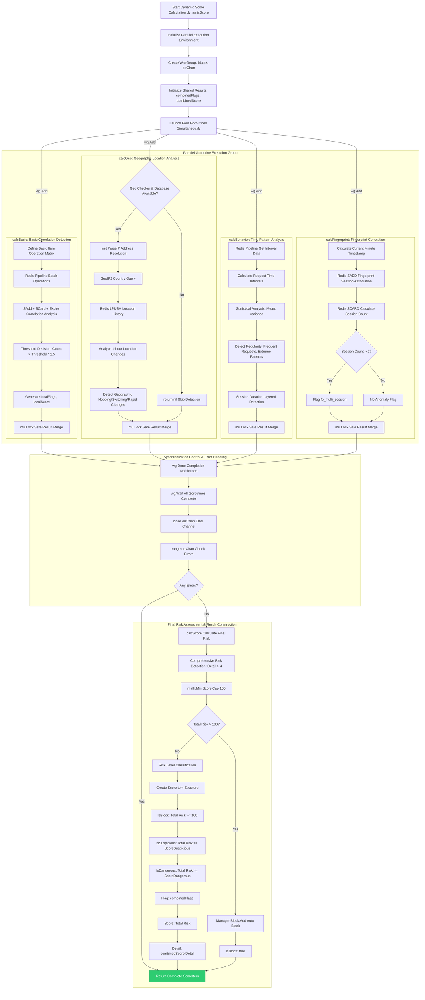
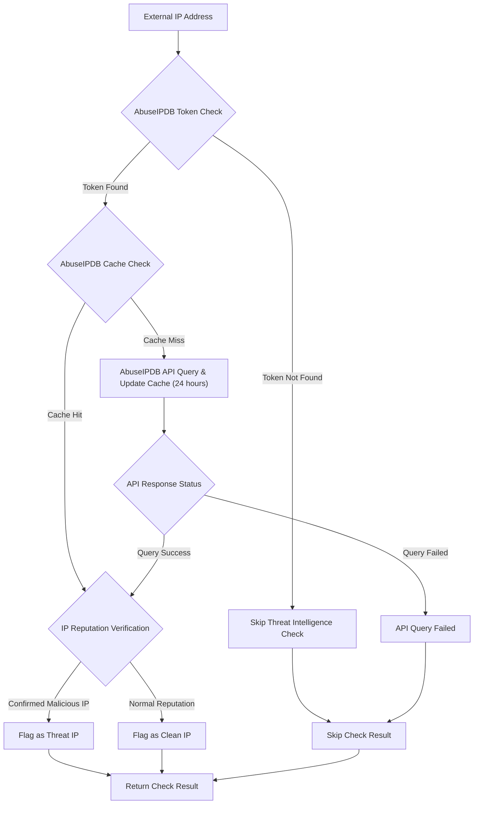

> [!Note]
> This content is translated by LLM. Original text can be found [here](README.zh.md)

# IP Sentry (Golang)

> A Go-based IP security protection package providing real-time threat detection, dynamic risk scoring, device fingerprinting, and multi-layered security mechanisms.

[](LICENSE)
[](https://github.com/pardnchiu/go-ip-sentry/releases)
[](README.zh.md) 

## Three Core Features

### Multi-Layer Security Protection
- **Whitelist Management**: Trusted list automatically bypasses security checks with file synchronization support
- **Blacklist System**: Permanent blocking of malicious IPs with integrated email notification
- **Dynamic Blocking**: Temporary blocking of suspicious activities using exponential time growth
- **Auto Escalation**: Repeated blocks automatically upgrade to permanent bans

### Intelligent Threat Detection
- **Device Fingerprinting**: SHA256 encrypted unique device identification with 365-day tracking
- **Behavioral Analysis**: Request patterns, time intervals, and session tracking
- **Geographic Monitoring**: Cross-country hopping, rapid location changes, and high-risk region detection
- **Correlation Analysis**: Multi-device, multi-IP, and multi-session anomaly detection
- **Login Behavior**: Login failure counts and 404 error frequency monitoring

### Dynamic Scoring System (Customizable Thresholds)
- **Real-time Calculation**: Multi-dimensional risk factor parallel computation
- **Adaptive Adjustment**: Dynamic rate limiting based on threat levels
- **Threshold Management**: Three-tier classification: suspicious, dangerous, blocking
- **Auto Rate Limiting**: Normal, suspicious, dangerous three-level restrictions

## Flow Charts

<details>
<summary>Main Flow</summary>



</details>

<details>
<summary>Device Information</summary>


</details>

<details>
<summary>Dynamic Scoring</summary>



</details>

<details>
<summary>AbuseIPDB (Not Yet Implemented)</summary>



</details>

## Dependencies

- [`github.com/gin-gonic/gin`](https://github.com/gin-gonic/gin)
- [`github.com/redis/go-redis/v9`](https://github.com/redis/go-redis)
- [`github.com/oschwald/geoip2-golang`](https://github.com/oschwald/geoip2-golang)
- [`github.com/pardnchiu/go-logger`](https://github.com/pardnchiu/go-logger): If you don't need this dependency, you can fork the project and replace it with your preferred logging solution. You can also vote [here](https://forms.gle/EvNLwzpHfxWR2gmP6) to let me know your preference.

## Usage

### Installation
```bash
go get github.com/pardnchiu/go-ip-sentry
```

### Basic Initialization
```go
package main

import (
  "log"
  "net/http"
  
  is "github.com/pardnchiu/go-ip-sentry"
)

func main() {
  config := is.Config{
    Redis: is.Redis{
      Host:     "localhost",
      Port:     6379,
      Password: "",
      DB:       0,
    },
    Log: &is.Log{
      Path:    "./logs/ip-sentry",
      Stdout:  false,
      MaxSize: 16 * 1024 * 1024,
    },
    Filepath: is.Filepath{
      CityDB:    "./GeoLite2-City.mmdb",
      CountryDB: "./GeoLite2-Country.mmdb",
      WhiteList: "./whiteList.json",
      BlackList: "./blackList.json",
    },
    Parameter: is.Parameter{
      BlockToBan:             3,
      BlockTimeMin:           30 * time.Minute,
      BlockTimeMax:           1800 * time.Minute,
      RateLimitNormal:        100,
      RateLimitSuspicious:    50,
      RateLimitDangerous:     20,
      ScoreSuspicious:        50,
      ScoreDangerous:         80,
    },
  }
  
  guardian, err := is.New(config)
  if err != nil {
    log.Fatal(err)
  }
  defer guardian.Close()
  
  // HTTP middleware
  handler := guardian.HTTPMiddleware(http.HandlerFunc(func(w http.ResponseWriter, r *http.Request) {
    w.WriteHeader(http.StatusOK)
    w.Write([]byte("Welcome"))
  }))
  
  http.Handle("/", handler)
  log.Println("Server starting on :8080")
  log.Fatal(http.ListenAndServe(":8080", nil))
}
```

### Gin Framework Integration
```go
package main

import (
  "github.com/gin-gonic/gin"
  is "github.com/pardnchiu/go-ip-sentry"
)

func main() {
  config := is.Config{
    // Same configuration as above
  }
  
  guardian, err := is.New(config)
  if err != nil {
    panic(err)
  }
  defer guardian.Close()
  
  r := gin.Default()
  
  // Use IP Sentry middleware
  r.Use(guardian.GinMiddleware())
  
  r.GET("/", func(c *gin.Context) {
    c.JSON(200, gin.H{
      "message": "Welcome",
    })
  })
  
  r.Run(":8080")
}
```

## Configuration Reference

```go
type Config struct {
  Redis     Redis        `json:"redis"`     // Redis connection config
  Email     *EmailConfig `json:"email"`     // Email notification config
  Log       *Log         `json:"log"`       // Logging config
  Filepath  Filepath     `json:"filepath"`  // File path config
  Parameter Parameter    `json:"parameter"` // Parameter config
}

type Redis struct {
  Host     string `json:"host"`     // Redis host
  Port     int    `json:"port"`     // Redis port
  Password string `json:"password"` // Redis password
  DB       int    `json:"db"`       // Redis database
}

type EmailConfig struct {
  Host     string                                 `json:"host"`     // SMTP host
  Port     int                                    `json:"port"`     // SMTP port
  Username string                                 `json:"username"` // SMTP username
  Password string                                 `json:"password"` // SMTP password
  From     string                                 `json:"from"`     // Sender
  To       []string                               `json:"to"`       // Recipients
  CC       []string                               `json:"cc"`       // CC recipients
  Subject  *func(ip string, reason string) string `json:"-"`        // Custom subject
  Body     *func(ip string, reason string) string `json:"-"`        // Custom body
}

type Log struct {
  Path      string // Log directory path (default: ./logs/mysqlPool)
  Stdout    bool   // Enable console output (default: false)
  MaxSize   int64  // Max size before file rotation (default: 16*1024*1024)
  MaxBackup int    // Number of log files to keep (default: 5)
  Type      string // Output format: "json" for slog standard, "text" for tree format (default: "text")
}

type Filepath struct {
  CityDB    string `json:"city_db"`    // GeoLite2-City.mmdb
  CountryDB string `json:"country_db"` // GeoLite2-Country.mmdb
  WhiteList string `json:"trust_list"` // Whitelist file
  BlackList string `json:"ban_list"`   // Blacklist file
}

type Parameter struct {
  HighRiskCountry        []string       `json:"high_risk_country"`         // High-risk country list
  BlockToBan             int            `json:"block_to_ban"`              // Block-to-ban count threshold
  BlockTimeMin           time.Duration  `json:"block_time_min"`            // Minimum block time
  BlockTimeMax           time.Duration  `json:"block_time_max"`            // Maximum block time
  RateLimitNormal        int            `json:"rate_limit_normal"`         // Normal request rate limit
  RateLimitSuspicious    int            `json:"rate_limit_suspicious"`     // Suspicious request rate limit
  RateLimitDangerous     int            `json:"rate_limit_dangerous"`      // Dangerous request rate limit
  SessionMultiIP         int            `json:"session_multi_ip"`          // Max IPs per session
  IPMultiDevice          int            `json:"ip_multi_device"`           // Max devices per IP
  DeviceMultiIP          int            `json:"device_multi_ip"`           // Max IPs per device
  LoginFailure           int            `json:"login_failure"`             // Max login failures per session
  NotFound404            int            `json:"not_found_404"`             // Max 404 requests per session
  ScoreSuspicious        int            `json:"score_suspicious"`          // Suspicious request threshold
  ScoreDangerous         int            `json:"score_dangerous"`           // Dangerous request threshold
  ScoreSessionMultiIP    int            `json:"score_session_multi_ip"`    // Multi-IP session risk score
  ScoreIPMultiDevice     int            `json:"score_ip_multi_device"`     // Multi-device IP risk score
  ScoreDeviceMultiIP     int            `json:"score_device_multi_ip"`     // Multi-IP device risk score
  ScoreFpMultiSession    int            `json:"score_fp_multi_session"`    // Multi-session fingerprint score
  ScoreGeoHighRisk       int            `json:"score_geo_high_risk"`       // High-risk geographic score
  ScoreGeoHopping        int            `json:"score_geo_hopping"`         // Geographic hopping score
  ScoreGeoFrequentSwitch int            `json:"score_geo_frequent_switch"` // Frequent geo switch score
  ScoreGeoRapidChange    int            `json:"score_geo_rapid_change"`    // Rapid geo change score
  ScoreIntervalRequest   int            `json:"score_interval_request"`    // Short interval request score
  ScoreFrequencyRequest  int            `json:"score_frequency_request"`   // Request frequency score
  ScoreLongConnection    int            `json:"score_long_connection"`     // Long connection score
  ScoreLoginFailure      int            `json:"score_login_failure"`       // Login failure score
  ScoreNotFound404       int            `json:"score_not_found_404"`       // 404 request score
}
```

## Available Functions

### Instance Management

- **New** - Create new instance
  ```go
  guardian, err := is.New(config)
  ```

- **Close** - Close instance
  ```go
  err := guardian.Close()
  ```

### IP Management

- **Check** - IP check
  ```go
  result := guardian.Check(r, w)
  ```

- **Allow.Add** - Add to whitelist
  ```go
  err := guardian.Manager.Allow.Add("192.168.1.100", "Internal server")
  ```

- **Deny.Add** - Add to blacklist
  ```go
  err := guardian.Manager.Deny.Add("1.2.3.4", "Malicious attack")
  ```

- **Block.Add** - Add to blocklist
  ```go
  err := guardian.Manager.Block.Add("5.6.7.8", "Suspicious behavior")
  ```

- **LoginFailure** - Login failure
  ```go
  err := guardian.LoginFailure(w, r)
  ```

- **NotFound404** - 404 error
  ```go
  err := guardian.NotFound404(w, r)
  ```

#### Middleware Usage
```go
// Standard HTTP middleware
handler := guardian.HTTPMiddleware(yourHandler)

// Gin middleware
router.Use(guardian.GinMiddleware())
```

## List Formats

### whiteList.json
```json
[
  {
    "ip": "192.168.1.100",
    "reason": "Internal server",
    "added_at": 1703980800
  }
]
```

### blackList.json
```json
[
  {
    "ip": "1.2.3.4",
    "reason": "Malicious attack",
    "added_at": 1703980800
  }
]
```

### Risk Scoring System

#### Basic Checks
- **Session Multi-IP Check**: Single session using multiple IPs
- **IP Multi-Device Check**: Single IP corresponding to multiple device fingerprints
- **Device Multi-IP Check**: Single device using multiple IPs
- **Login Failure Monitoring**: Record failure count, trigger risk when exceeding threshold
- **404 Error Tracking**: Monitor abnormal path probing behavior

#### Geographic Analysis
- **High-Risk Countries**: Configurable high-risk region list
- **Geographic Hopping**: Alert triggered by >4 countries within 1 hour
- **Frequent Switching**: City switching >4 times within 1 hour
- **Rapid Changes**: Movement speed >800 km/h or crossing 500 km within 30 minutes
- **Distance Calculation**: Uses Haversine formula for Earth surface distance

#### Behavioral Analysis
- **Request Interval Regularity Detection**: Variance <1000 with regular intervals
- **Long Connection Time Monitoring**: Tiered alerts for >1/2/4 hours
- **Frequent Request Pattern Identification**: >16 requests within 500ms
- **Extreme Regularity Detection**: Variance <100 with ≥8 samples

#### Fingerprint Analysis
- **Same Fingerprint Multi-Session Detection**: Single fingerprint >2 sessions within 1 minute
- **Minute-Level Statistical Protection**: Uses timestamp segmentation to avoid false positives

## License

This source code project is licensed under the [MIT](LICENSE) license.

## Author


<h4 style="padding-top: 0">邱敬幃 Pardn Chiu</h4>

<a href="mailto:dev@pardn.io" target="_blank">
  
</a> <a href="https://linkedin.com/in/pardnchiu" target="_blank">
  
</a>

***

©️ 2025 [邱敬幃 Pardn Chiu](https://pardn.io)
