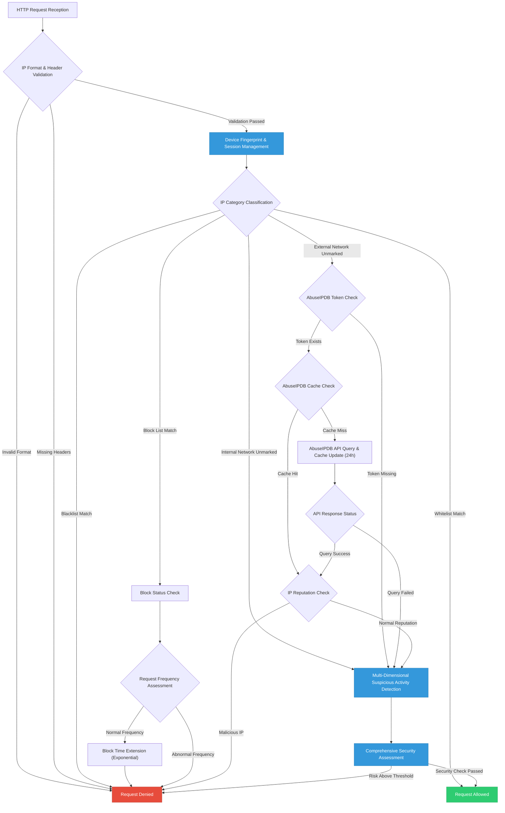

# IP Guardian

## Main Flow

```mermaid
flowchart TD
  A["HTTP Request Reception"] --> V1{"IP Format & Header Validation"}
  V1 -->|"Invalid Format"| Y["Request Denied"]:::danger
  V1 -->|"Missing Headers"| Y
  V1 -->|"Validation Passed"| DEVICE_INFO["Device Fingerprint & Session Management"]:::module
  
  DEVICE_INFO --> L{"IP Category Classification"}
  L -->|"Block List Match"| BT["Block Status Check"]
  L -->|"Internal Network Unmarked"| DYNAMIC_SCORE
  L -->|"External Network Unmarked"| T_TOKEN{"AbuseIPDB Token Check"}
  L -->|"Whitelist Match"| Z_ALLOW["Request Allowed"]:::success
  L -->|"Blacklist Match"| Y
  
  BT --> BD{"Request Frequency Assessment"}
  BD -->|"Normal Frequency"| BF["Block Time Extension (Exponential)"] --> Y
  BD -->|"Abnormal Frequency"| Y
  
  T_TOKEN -->|"Token Missing"| DYNAMIC_SCORE
  T_TOKEN -->|"Token Exists"| D{"AbuseIPDB Cache Check"}
  D -->|"Cache Hit"| E1{"IP Reputation Check"}
  D -->|"Cache Miss"| F_API["AbuseIPDB API Query & Cache Update (24h)"]
  F_API --> M_API{"API Response Status"}
  M_API -->|"Query Failed"| DYNAMIC_SCORE
  M_API -->|"Query Success"| E1
  
  E1 -->|"Malicious IP"| Y
  E1 -->|"Normal Reputation"| DYNAMIC_SCORE["Multi-Dimensional Suspicious Activity Detection"]:::module
  
  DYNAMIC_SCORE --> SECURE_RESULT["Comprehensive Security Assessment"]:::module
  
  SECURE_RESULT -->|"Security Check Passed"| Z_ALLOW
  SECURE_RESULT -->|"Risk Above Threshold"| Y
  
  classDef success fill:#2ecc71,stroke:#27ae60,color:#ffffff
  classDef danger fill:#e74c3c,stroke:#c0392b,color:#ffffff
  classDef module fill:#3498db,stroke:#2980b9,color:#ffffff
  
  class A,V1,L main
```

## Device Fingerprint & Session Management

```mermaid
graph TD
    A[HTTP Request Reception] --> E{Proxy Header Detection}
    E -->|CF-Connecting-IP| F[Extract Real IP from Headers]
    E -->|X-Forwarded-For| F
    E -->|X-Real-IP| F
    E -->|Other Proxy Headers| F
    E -->|No Headers| G[Use RemoteAddr]
    
    F --> H[IP Address Parse]
    G --> H
    H --> I[Internal IP Check]
    
    I --> J{Proxy Headers Present?}
    J -->|Yes| K[Proxy Chain Integrity Check]
    J -->|No| L[Direct Connection IP Check]
    
    K --> M{All Proxy Chain Internal?}
    L --> N{Direct IP Internal?}
    
    M -->|Yes| O[IsPrivate=true, Level=1]
    M -->|No| P[IsPrivate=false, Level=0]
    N -->|Yes| O
    N -->|No| P
    
    O --> Q[User-Agent Header Parse]
    P --> Q
    
    Q --> R[Platform Info Extract]
    Q --> S[Browser Info Extract]
    Q --> T[Device Type Identify]
    Q --> U[OS Identify]
    
    R --> V[Device Base Info Structure]
    S --> V
    T --> V
    U --> V
    
    V --> X{Session Cookie Exists?}
    
    X -->|Yes| Y[Session ID Signature Parse]
    Y --> Z{HMAC-SHA256 Valid?}
    Z -->|Yes| AA[Extend Session Cookie 30 days]
    AA --> BB[Return Existing Session ID]
    
    Z -->|No| CC[Generate New Session ID Signature]
    X -->|No| CC
    
    CC --> DD[Generate 32-char Session ID]
    DD --> EE[Calculate HMAC-SHA256]
    EE --> FF[Combine s:sessionID.signature]
    FF --> GG[Set Session Cookie 30d Sliding]
    GG --> HH[Return New Session ID]
    
    BB --> JJ{Device Cookie Exists?}
    HH --> JJ
    
    JJ -->|Yes| KK[Read Existing Device Key]
    KK --> LL[Extend Device Cookie 365d]
    
    JJ -->|No| MM[Generate UUID Device Key]
    MM --> NN[Set Device Cookie 365d Sliding]
    
    LL --> OO[Complete Device Info]
    NN --> OO
    OO --> PP[Platform+Browser+Type+OS+Key]
    PP --> QQ[SHA256 Device Fingerprint]
    QQ --> TT[Return Device Fingerprint & Session]
    
    subgraph "IP Detection & Proxy Validation"
        E
        F
        G
        H
        I
        J
        K
        L
        M
        N
    end
    
    subgraph "User-Agent Parse Engine"
        R
        S
        T
        U
    end
    
    subgraph "Session Management (30d Sliding)"
        X
        Y
        Z
        AA
        CC
        DD
        EE
        FF
        GG
    end
    
    subgraph "Device Fingerprint Tracking (365d Sliding)"
        JJ
        KK
        LL
        MM
        NN
        OO
        PP
        QQ
    end
```

## Dynamic Score

```mermaid
graph TD
    A[Start Suspicious Activity Detection] --> B[Build Request Data Structure]
    B --> C[Initialize Anomaly Flags & Risk Score]
    
    C --> D[Basic Correlation Pattern Detection]
    D --> E[Execute Redis Pipeline Batch]
    E --> F[Session-IP Correlation Check]
    E --> G[IP-Device Correlation Check]
    E --> H[Device-IP Correlation Check]
    
    F --> I{Session Associated IPs > 4?}
    G --> J{IP Associated Devices > 8?}
    H --> K{Device Associated IPs > 8?}
    
    I -->|Yes| L[+25pts Multi-IP Session Anomaly]
    J -->|Yes| M[+20pts Multi-Device IP Anomaly]
    K -->|Yes| N[+15pts Multi-IP Device Anomaly]
    
    I -->|No| O[Geographic Behavior Detection]
    J -->|No| O
    K -->|No| O
    L --> O
    M --> O
    N --> O
    
    O --> P{GeoIP Detector Available?}
    P -->|No| Q[Skip Geo Detection]
    P -->|Yes| R[Get IP Geolocation Data]
    
    R --> S[Write Location History to Redis]
    S --> T[Analyze 1h Location Changes]
    
    T --> U{More than 4 Countries in 1h?}
    T --> V{Frequent Country Switching?}
    T --> W{Abnormal Quick Location Changes?}
    
    U -->|Yes| X[+15pts Geographic Jump Anomaly]
    V -->|Yes| Y[+20pts Frequent Country Switch]
    W -->|Yes| Z[+25pts Rapid Geo Change Anomaly]
    
    Q --> AA[Time Pattern Detection]
    U -->|No| AA
    V -->|No| AA
    W -->|No| AA
    X --> AA
    Y --> AA
    Z --> AA
    
    AA --> BB[Get Last Request Timestamp]
    BB --> CC[Calculate Request Interval]
    CC --> DD[Analyze Interval Patterns]
    
    DD --> EE{Too Regular Intervals?}
    DD --> FF{Session Duration > 2h?}
    
    EE -->|Yes| GG[+25pts Regular Bot Pattern]
    FF -->|Yes| HH[+15pts Long Session Anomaly]
    
    EE -->|No| II[Device Fingerprint Correlation]
    FF -->|No| II
    GG --> II
    HH --> II
    
    II --> JJ[Check Multi-Session Same Fingerprint]
    JJ --> KK{Fingerprint Sessions > 2?}
    KK -->|Yes| LL[+25pts Multi-Session Fingerprint]
    KK -->|No| MM[Calculate Total Risk Score]
    LL --> MM
    
    MM --> NN{Anomaly Types > 4?}
    NN -->|Yes| OO[+25pts Multi-Anomaly Weight]
    NN -->|No| PP[Cap Risk Score at 100]
    OO --> PP
    
    PP --> QQ[Write Results to Redis]
    QQ --> RR{Anomalies OR Risk Score > 50?}
    
    RR -->|Yes| SS[IsSuspicious = true]
    RR -->|No| TT[IsSuspicious = false]
    
    SS --> UU[Return DetectionResult]
    TT --> UU
    
    subgraph "Basic Correlation Pattern Detection (Redis Pipeline)"
        E
        F
        G
        H
        I
        J
        K
    end
    
    subgraph "Geographic Behavior Detection (GeoIP)"
        R
        S
        T
        U
        V
        W
    end
    
    subgraph "Time Pattern Detection (Interval Analysis)"
        BB
        CC
        DD
        EE
        FF
    end
    
    subgraph "Device Fingerprint Correlation (Session Track)"
        JJ
        KK
    end
    
    subgraph "Risk Assessment & Result"
        MM
        NN
        QQ
        RR
    end
```