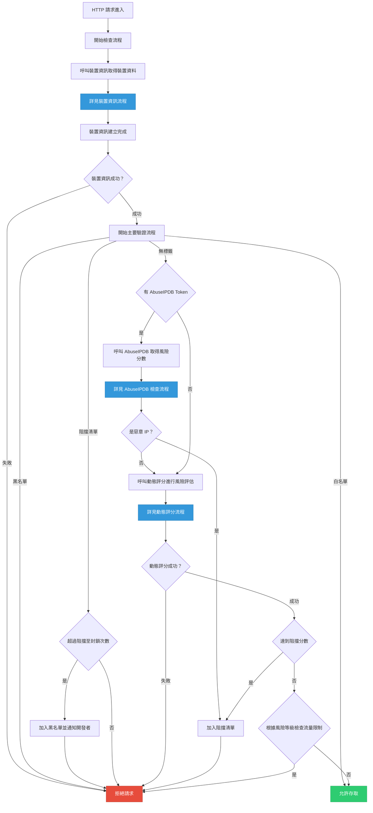
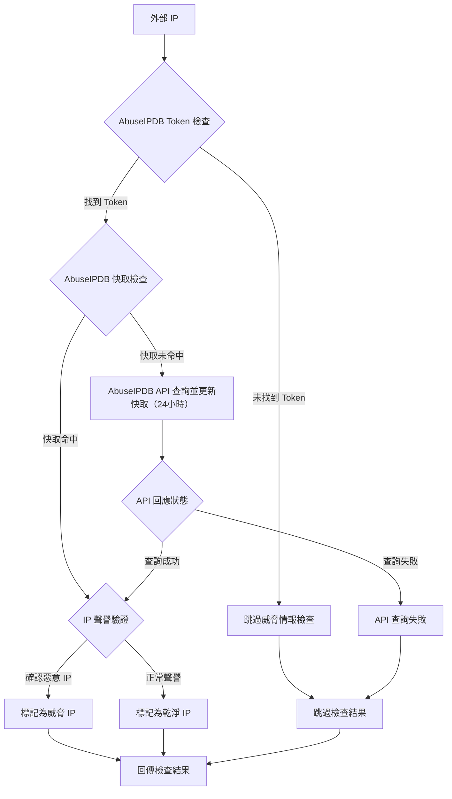
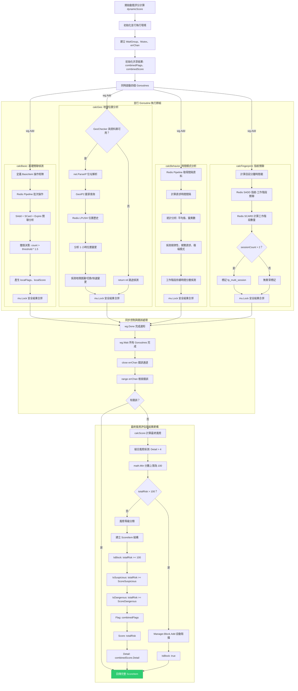

```mermaid
graph TD
  A[HTTP 請求接收] --> B[getDevice 提取裝置資訊]
  
  B --> C[r.UserAgent 取得 User-Agent]
  C --> D[getClientIP IP 位址解析]
  
  D --> E[檢查代理標頭優先順序]
  E --> F1[CF-Connecting-IP Cloudflare]
  E --> F2[X-Forwarded-For 標準反向代理]
  E --> F3[X-Real-IP Nginx]
  E --> F4[X-Client-IP Apache]
  E --> F5[其他代理標頭]
  
  F1 --> G[解析並驗證 IP 格式]
  F2 --> G
  F3 --> G
  F4 --> G
  F5 --> G
  
  G --> H{有效代理 IP？}
  H -->|否| I[使用 RemoteAddr]
  H -->|是| J[isInternalIP 內部網路檢查]
  I --> J
  
  J --> K[hasProxyHeader 代理標頭檢查]
  K --> L{有代理標頭？}
  L -->|是| M[checkProxy 代理鏈驗證]
  L -->|否| N[直接 IP 內部網路檢查]
  
  M --> O[isInternalIPRange CIDR 檢查]
  N --> O
  O --> P[設定 isPrivate 和 ipTrustLevel]
  
  P --> Q[User-Agent 解析流程]
  Q --> R[getPlatform 平台識別]
  R --> S[getBrowser 瀏覽器識別]
  S --> T[getType 裝置類型識別]
  T --> U[getOS 作業系統識別]
  
  U --> V[建立基礎裝置結構]
  V --> W[管理器狀態檢查]
  W --> X[Trust.check 信任清單檢查]
  X --> Y[Ban.check 封鎖清單檢查]
  Y --> Z[Block.check 阻擋清單檢查]
  
  Z --> AA[requestCountInMin 分鐘請求次數]
  AA --> BB[blockCountInHour 小時阻擋次數]
  
  BB --> CC[getSessionID 工作階段管理]
  CC --> DD{工作階段 Cookie 存在？}
  
  DD -->|是| EE[parseSignedSessionID 解析簽章]
  EE --> FF{HMAC-SHA256 簽章有效？}
  FF -->|是| GG[延長 Cookie 30 天]
  FF -->|否| HH[createSignedSessionID 建立新工作階段]
  
  DD -->|否| HH
  HH --> II[generateSessionID 產生 32 字元 ID]
  II --> JJ[signSessionID HMAC 簽章]
  JJ --> KK[格式: s:sessionID.signature]
  KK --> LL[設定 30 天 HttpOnly Cookie]
  
  GG --> MM[getFingerprint 裝置指紋產生]
  LL --> MM
  
  MM --> NN{裝置 Cookie 存在？}
  NN -->|是| OO[讀取現有裝置金鑰]
  NN -->|否| PP[uuid 產生 128 字元隨機金鑰]
  
  OO --> QQ[延長 Cookie 365 天]
  PP --> RR[設定 365 天 HttpOnly Cookie]
  
  QQ --> SS[建立指紋資訊字串]
  RR --> SS
  SS --> TT[平台/瀏覽器/類型/作業系統/金鑰]
  TT --> UU[SHA256 雜湊計算]
  UU --> VV[hex.EncodeToString 指紋產生]
  
  VV --> WW[回傳完整裝置結構]
  
  subgraph "IP 位址解析與代理偵測"
    D
    E
    F1
    F2
    F3
    F4
    F5
    G
    H
    I
    J
    K
    L
    M
    N
    O
    P
  end
  
  subgraph "User-Agent 解析引擎"
    Q
    R
    S
    T
    U
  end
  
  subgraph "安全狀態檢查"
    W
    X
    Y
    Z
    AA
    BB
  end
  
  subgraph "工作階段管理（30 天滑動視窗）"
    CC
    DD
    EE
    FF
    GG
    HH
    II
    JJ
    KK
    LL
  end
  
  subgraph "裝置指紋追蹤（365 天滑動視窗）"
    MM
    NN
    OO
    PP
    QQ
    RR
    SS
    TT
    UU
    VV
  end
  
  classDef success fill:#2ecc71,stroke:#27ae60,color:#ffffff
  
  class WW success
  class X,Y,Z security
  class R,S,T,U process
  class II,JJ,UU,VV crypto
```

# IP Guardian - IP 安全、限流與自動封鎖

## 概述

IP Guardian 是一個高效能的 Go 語言 IP 安全防護系統，提供即時威脅偵測、動態風險評分、設備指紋識別等多層安全防護機制。系統採用 Redis 作為高速快取層，支援併發處理與自動化威脅回應。

## 主要特色

### 多層安全防護
- **白名單管理**: 信任清單自動跳過安全檢查
- **黑名單系統**: 永久封鎖惡意 IP 位址
- **動態阻擋**: 臨時封鎖可疑活動，支援指數級時間增長
- **自動升級**: 重複阻擋自動升級至永久封鎖

### 智慧威脅偵測
- **設備指紋**: SHA256 加密的唯一設備識別
- **行為分析**: 請求模式、時間間隔、工作階段追蹤
- **地理位置監控**: 跨國跳躍、快速位置變更偵測
- **關聯分析**: 多設備、多 IP、多工作階段異常偵測

### 高效能架構
- **併發處理**: 並行風險評估
- **Redis 快取**: 毫秒級查詢回應
- **Pipeline 批次**: 減少網路延遲
- **記憶體最佳化**: 本地快取與 Redis 雙層架構

### 動態評分系統
- **即時計算**: 基於多維度風險因子
- **自適應調整**: 根據威脅等級動態限流
- **閾值管理**: 可疑、危險、阻擋三級分類
- **自動限流**: 正常、可疑、危險三級限流

## 系統架構

<details>
<summary>主要流程</summary>



</details>

<details>
<summary>裝置資訊</summary>



</details>

</details>

<details>
<summary>AbuseIPDB（未實作）</summary>



</details>

</details>

<details>
<summary>動態評分</summary>




</details>

### 配置介紹

```go
config := &golangIPGuardian.Config{
    Redis: golangIPGuardian.Redis{
        Host:     "redis-cluster.example.com",
        Port:     6379,
        Password: "your-redis-password",
        DB:       1,
    },
    Email: &golangIPGuardian.EmailConfig{
        Host:     "smtp.gmail.com",
        Port:     587,
        Username: "your-email@example.com",
        Password: "your-app-password",
        From:     "security@your-domain.com",
        To:       []string{"admin@your-domain.com"},
    },
    Log: golangIPGuardian.LogConfig{
        Path:    "/var/log/ipguardian",
        Stdout:  false,
        MaxSize: 100 * 1024 * 1024, // 100MB
    },
    Parameter: golangIPGuardian.Parameter{
        // 阻擋策略
        BlockToBan:             5,           // 5次阻擋後永久封鎖
        BlockTimeMin:           1800,        // 30分鐘起始阻擋
        BlockTimeMax:           86400 * 7,   // 7天最大阻擋
        
        // 流量限制
        RateLimitNormal:        200,         // 正常用戶 200 req/min
        RateLimitSuspicious:    50,          // 可疑用戶 50 req/min
        RateLimitDangerous:     10,          // 危險用戶 10 req/min
        
        // 關聯限制
        SessionMultiIP:         3,           // 單一 Session 最多 3 個 IP
        IPMultiDevice:          5,           // 單一 IP 最多 5 個設備
        DeviceMultiIP:          2,           // 單一設備最多 2 個 IP
        
        // 風險評分
        ScoreNormal:            0,
        ScoreSuspicious:        40,          // 降低可疑閾值
        ScoreDangerous:         70,          // 降低危險閾值
        ScoreSessionMultiIP:    20,
        ScoreIPMultiDevice:     25,
        ScoreDeviceMultiIP:     15,
        ScoreFpMultiSession:    30,
        ScoreGeoHopping:        20,
        ScoreGeoFrequentSwitch: 25,
        ScoreGeoRapidChange:    30,
        ScoreLongConnection:    10,
        ScoreIntervalRequest:   15,
    },
}
```