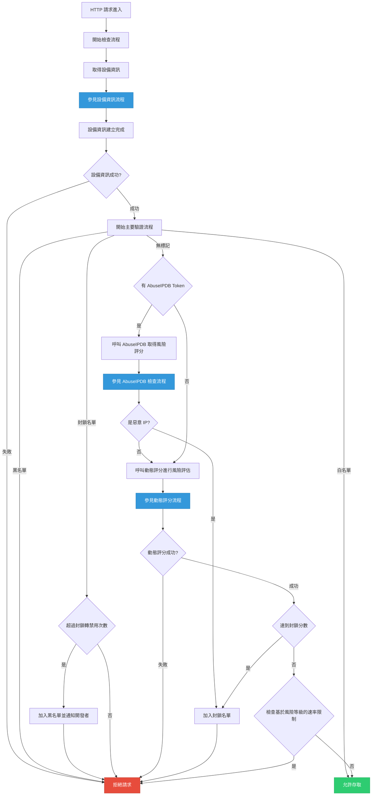
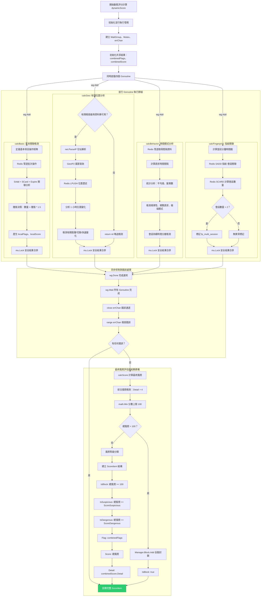
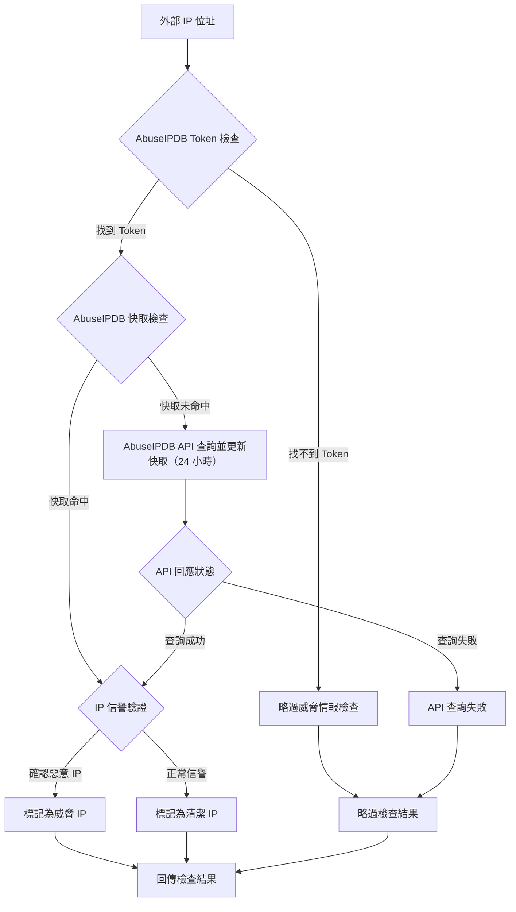

```mermaid
graph TD
  A[收到 HTTP 請求] --> B[getDevice 提取設備資訊]
  
  B --> C[r.UserAgent 取得 User-Agent]
  C --> D[getClientIP IP 位址解析]
  
  D --> E[檢查代理伺服器標頭優先級]
  E --> F1[CF-Connecting-IP Cloudflare]
  E --> F2[X-Forwarded-For 標準反向代理]
  E --> F3[X-Real-IP Nginx]
  E --> F4[X-Client-IP Apache]
  E --> F5[其他代理標頭]
  
  F1 --> G[解析並驗證 IP 格式]
  F2 --> G
  F3 --> G
  F4 --> G
  F5 --> G
  
  G --> H{有效的代理 IP?}
  H -->|否| I[使用 RemoteAddr]
  H -->|是| J[isInternalIP 內部網路檢查]
  I --> J
  
  J --> K[hasProxyHeader 代理標頭檢查]
  K --> L{有代理標頭?}
  L -->|是| M[checkProxy 代理鏈驗證]
  L -->|否| N[直接 IP 內部網路檢查]
  
  M --> O[isInternalIPRange CIDR 檢查]
  N --> O
  O --> P[設定 isPrivate 和 ipTrustLevel]
  
  P --> Q[User-Agent 解析流程]
  Q --> R[getPlatform 平台識別]
  R --> S[getBrowser 瀏覽器識別]
  S --> T[getType 設備類型識別]
  T --> U[getOS 作業系統識別]
  
  U --> V[建立基本設備結構]
  V --> W[Manager 狀態檢查]
  W --> X[Trust.check 信任清單檢查]
  X --> Y[Ban.check 封鎖清單檢查]
  Y --> Z[Block.check 阻擋清單檢查]
  
  Z --> AA[requestCountInMin 分鐘請求計數]
  AA --> BB[blockCountInHour 小時封鎖計數]
  
  BB --> CC[getSessionID 會話管理]
  CC --> DD{會話 Cookie 存在?}
  
  DD -->|是| EE[parseSignedSessionID 解析簽章]
  EE --> FF{HMAC-SHA256 簽章有效?}
  FF -->|是| GG[延長 Cookie 30 天]
  FF -->|否| HH[createSignedSessionID 建立新會話]
  
  DD -->|否| HH
  HH --> II[generateSessionID 產生 32 字元 ID]
  II --> JJ[signSessionID HMAC 簽章]
  JJ --> KK[格式: s:sessionID.signature]
  KK --> LL[設定 30 天 HttpOnly Cookie]
  
  GG --> MM[getFingerprint 設備指紋生成]
  LL --> MM
  
  MM --> NN{設備 Cookie 存在?}
  NN -->|是| OO[讀取現有設備金鑰]
  NN -->|否| PP[uuid 產生 128 字元隨機金鑰]
  
  OO --> QQ[延長 Cookie 365 天]
  PP --> RR[設定 365 天 HttpOnly Cookie]
  
  QQ --> SS[建立指紋資訊字串]
  RR --> SS
  SS --> TT[平台/瀏覽器/類型/系統/金鑰]
  TT --> UU[SHA256 雜湊計算]
  UU --> VV[hex.EncodeToString 指紋生成]
  
  VV --> WW[回傳完整設備結構]
  
  subgraph "IP 位址解析與代理檢測"
  D
  E
  F1
  F2
  F3
  F4
  F5
  G
  H
  I
  J
  K
  L
  M
  N
  O
  P
  end
  
  subgraph "User-Agent 解析引擎"
  Q
  R
  S
  T
  U
  end
  
  subgraph "安全狀態檢查"
  W
  X
  Y
  Z
  AA
  BB
  end
  
  subgraph "會話管理（30 天滑動視窗）"
  CC
  DD
  EE
  FF
  GG
  HH
  II
  JJ
  KK
  LL
  end
  
  subgraph "設備指紋追蹤（365 天滑動視窗）"
  MM
  NN
  OO
  PP
  QQ
  RR
  SS
  TT
  UU
  VV
  end
  
  classDef success fill:#2ecc71,stroke:#27ae60,color:#ffffff
  
  class WW success
  class X,Y,Z security
  class R,S,T,U process
  class II,JJ,UU,VV crypto
```

# IP Sentry (Golang)

> 一個 Go 語言 IP 安全防護套件，提供即時威脅檢測、動態風險評分、設備指紋識別和多層安全機制。

[](LICENSE)
[](https://github.com/pardnchiu/go-ip-sentry/releases)
[](README.zh.md) 

## 三大主軸

### 多層安全防護
- **白名單管理**：信任清單自動跳過安全檢查，支援檔案同步
- **黑名單系統**：永久封鎖惡意 IP，整合 Email 通知機制
- **動態封鎖**：暫時封鎖可疑活動，採用指數時間增長
- **自動升級**：重複封鎖自動升級為永久禁用

### 智慧威脅檢測
- **設備指紋**：SHA256 加密唯一設備識別，365 天追蹤
- **行為分析**：請求模式、時間間隔、工作階段追蹤
- **地理位置監控**：跨國跳躍、快速位置變化、高風險地區檢測
- **關聯分析**：多設備、多 IP、多工作階段異常檢測
- **登入行為**：登入失敗次數和 404 錯誤頻率監控

### 動態評分系統 (可自行設置閾值)
- **即時計算**：多維度風險因子平行計算
- **適應調整**：基於威脅等級的動態速率限制
- **閾值管理**：可疑、危險、封鎖三層分級
- **自動限速**：正常、可疑、危險 三層限制

## 流程圖

<details>
<summary>主要流程</summary>



</details>

<details>
<summary>裝置資訊</summary>



</details>

<details>
<summary>動態評分</summary>




</details>

<details>
<summary>AbuseIPDB（尚未實作）</summary>



</details>

## 依賴套件

- [`github.com/gin-gonic/gin`](https://github.com/gin-gonic/gin)
- [`github.com/redis/go-redis/v9`](https://github.com/redis/go-redis)
- [`github.com/oschwald/geoip2-golang`](https://github.com/oschwald/geoip2-golang)
- [`github.com/pardnchiu/go-logger`](https://github.com/pardnchiu/go-logger): 如果你不需要，你可以 fork 然後使用你熟悉的取代。更可以到[這裡](https://forms.gle/EvNLwzpHfxWR2gmP6)進行投票讓我知道。

## 使用方法

### 安裝
```bash
go get github.com/pardnchiu/go-ip-sentry
```

### 基本初始化
```go
package main

import (
  "log"
  "net/http"
  
  is "github.com/pardnchiu/go-ip-sentry"
)

func main() {
  config := is.Config{
    Redis: is.Redis{
      Host:     "localhost",
      Port:     6379,
      Password: "",
      DB:       0,
    },
    Log: &is.Log{
      Path:    "./logs/ip-sentry",
      Stdout:  false,
      MaxSize: 16 * 1024 * 1024,
    },
    Filepath: is.Filepath{
      CityDB:    "./GeoLite2-City.mmdb",
      CountryDB: "./GeoLite2-Country.mmdb",
      WhiteList: "./whiteList.json",
      BlackList: "./blackList.json",
    },
    Parameter: is.Parameter{
      BlockToBan:             3,
      BlockTimeMin:           30 * time.Minute,
      BlockTimeMax:           1800 * time.Minute,
      RateLimitNormal:        100,
      RateLimitSuspicious:    50,
      RateLimitDangerous:     20,
      ScoreSuspicious:        50,
      ScoreDangerous:         80,
    },
  }
  
  guardian, err := is.New(config)
  if err != nil {
    log.Fatal(err)
  }
  defer guardian.Close()
  
  // HTTP 中間件
  handler := guardian.HTTPMiddleware(http.HandlerFunc(func(w http.ResponseWriter, r *http.Request) {
    w.WriteHeader(http.StatusOK)
    w.Write([]byte("歡迎訪問"))
  }))
  
  http.Handle("/", handler)
  log.Println("伺服器啟動:8080")
  log.Fatal(http.ListenAndServe(":8080", nil))
}
```

### Gin 框架整合
```go
package main

import (
  "github.com/gin-gonic/gin"
  is "github.com/pardnchiu/go-ip-sentry"
)

func main() {
  config := is.Config{
    // 配置同上
  }
  
  guardian, err := is.New(config)
  if err != nil {
    panic(err)
  }
  defer guardian.Close()
  
  r := gin.Default()
  
  // 使用 IP Sentry 中間件
  r.Use(guardian.GinMiddleware())
  
  r.GET("/", func(c *gin.Context) {
    c.JSON(200, gin.H{
      "message": "歡迎訪問",
    })
  })
  
  r.Run(":8080")
}
```

## 配置介紹

```go
type Config struct {
  Redis     Redis        `json:"redis"`     // Redis 連線配置
  Email     *EmailConfig `json:"email"`     // Email 通知配置
  Log       *Log         `json:"log"`       // 日誌配置
  Filepath  Filepath     `json:"filepath"`  // 檔案路徑配置
  Parameter Parameter    `json:"parameter"` // 參數配置
}

type Redis struct {
  Host     string `json:"host"`     // Redis 主機
  Port     int    `json:"port"`     // Redis 埠
  Password string `json:"password"` // Redis 密碼
  DB       int    `json:"db"`       // Redis 資料庫
}

type EmailConfig struct {
  Host     string                                 `json:"host"`     // SMTP 主機
  Port     int                                    `json:"port"`     // SMTP 埠
  Username string                                 `json:"username"` // SMTP 用戶名
  Password string                                 `json:"password"` // SMTP 密碼
  From     string                                 `json:"from"`     // 寄件者
  To       []string                               `json:"to"`       // 收件者
  CC       []string                               `json:"cc"`       // 副本收件者
  Subject  *func(ip string, reason string) string `json:"-"`        // 自定義主旨
  Body     *func(ip string, reason string) string `json:"-"`        // 自定義內容
}

type Log struct {
  Path      string // 日誌目錄路徑 (預設: ./logs/mysqlPool)
  Stdout    bool   // 啟用控制台輸出 (預設: false)
  MaxSize   int64  // 檔案輪轉前的最大大小 (預設: 16*1024*1024)
  MaxBackup int    // 保留的日誌檔案數量 (預設: 5)
  Type      string // 輸出格式："json" 為 slog 標準，"text" 為樹狀格式（預設："text"）
}

type Filepath struct {
  CityDB    string `json:"city_db"`    // GeoLite2-City.mmdb
  CountryDB string `json:"country_db"` // GeoLite2-Country.mmdb
  WhiteList string `json:"trust_list"` // 白名單檔案
  BlackList string `json:"ban_list"`   // 黑名單檔案
}

type Parameter struct {
  HighRiskCountry        []string       `json:"high_risk_country"`         // 高風險國家列表
  BlockToBan             int            `json:"block_to_ban"`              // 封鎖到禁用的次數
  BlockTimeMin           time.Duration  `json:"block_time_min"`            // 最小封鎖時間
  BlockTimeMax           time.Duration  `json:"block_time_max"`            // 最大封鎖時間
  RateLimitNormal        int            `json:"rate_limit_normal"`         // 正常請求速率限制
  RateLimitSuspicious    int            `json:"rate_limit_suspicious"`     // 可疑請求速率限制
  RateLimitDangerous     int            `json:"rate_limit_dangerous"`      // 危險請求速率限制
  SessionMultiIP         int            `json:"session_multi_ip"`          // 單一會話允許的最大 IP 數
  IPMultiDevice          int            `json:"ip_multi_device"`           // 單一 IP 允許的最大設備數
  DeviceMultiIP          int            `json:"device_multi_ip"`           // 單一設備允許的最大 IP 數
  LoginFailure           int            `json:"login_failure"`             // 單一會話允許的最大登入失敗次數
  NotFound404            int            `json:"not_found_404"`             // 單一會話允許的最大 404 請求數
  ScoreSuspicious        int            `json:"score_suspicious"`          // 可疑請求閾值
  ScoreDangerous         int            `json:"score_dangerous"`           // 危險請求閾值
  ScoreSessionMultiIP    int            `json:"score_session_multi_ip"`    // 單一會話多 IP 風險分數
  ScoreIPMultiDevice     int            `json:"score_ip_multi_device"`     // 單一 IP 多設備風險分數
  ScoreDeviceMultiIP     int            `json:"score_device_multi_ip"`     // 單一設備多 IP 風險分數
  ScoreFpMultiSession    int            `json:"score_fp_multi_session"`    // 單一指紋多會話風險分數
  ScoreGeoHighRisk       int            `json:"score_geo_high_risk"`       // 高風險地理位置分數
  ScoreGeoHopping        int            `json:"score_geo_hopping"`         // 地理位置跳躍分數
  ScoreGeoFrequentSwitch int            `json:"score_geo_frequent_switch"` // 地理位置頻繁切換分數
  ScoreGeoRapidChange    int            `json:"score_geo_rapid_change"`    // 地理位置快速變化分數
  ScoreIntervalRequest   int            `json:"score_interval_request"`    // 短時間內請求分數
  ScoreFrequencyRequest  int            `json:"score_frequency_request"`   // 請求頻率分數
  ScoreLongConnection    int            `json:"score_long_connection"`     // 長連接分數
  ScoreLoginFailure      int            `json:"score_login_failure"`       // 登入失敗分數
  ScoreNotFound404       int            `json:"score_not_found_404"`       // 404 請求分數
}
```

## 可用函式

### 實例管理

- **New** - 建立新的實例
  ```go
  pool err := is.New(config)
  ```

- **Close** - 關閉實例
  ```go
  err := pool.Close()
  ```

### IP 管理

- **Check** - IP 檢查
  ```go
  result := guardian.Check(r, w)
  ```

- **Allow.Add** - 加入白名單
  ```go
  err := guardian.Manager.Allow.Add("192.168.1.100", "內部伺服器")
  ```

- **Deny.Add** - 加入黑名單
  ```go
  err := guardian.Manager.Deny.Add("1.2.3.4", "惡意攻擊")
  ```

- **Block.Add** - 加入封鎖名單
  ```go
  err := guardian.Manager.Block.Add("5.6.7.8", "可疑行為")
  ```

- **LoginFailure** - 登入失敗
  ```go
  err := guardian.LoginFailure(w, r)
  ```

- **NotFound404** - 登入失敗
  ```go
  err := guardian.NotFound404(w, r)
  ```

#### 中間件使用
```go
// HTTP 標準中間件
handler := guardian.HTTPMiddleware(yourHandler)

// Gin 中間件
router.Use(guardian.GinMiddleware())
```

## 名單格式

### whiteList.json
```json
[
  {
    "ip": "192.168.1.100",
    "reason": "內部伺服器",
    "added_at": 1703980800
  }
]
```

### blackList.json
```json
[
  {
    "ip": "1.2.3.4",
    "reason": "惡意攻擊",
    "added_at": 1703980800
  }
]
```

### 風險評分系統

#### 基本檢查
- **會話多 IP 檢查**：單一會話使用多個 IP
- **IP 多設備檢查**：單一 IP 對應多個設備指紋
- **設備多 IP 檢查**：單一設備使用多個 IP
- **登入失敗監控**：記錄失敗次數，超過閾值觸發風險
- **404 錯誤追蹤**：監控異常路徑探測行為

#### 地理位置分析
- **高風險國家**：可配置高風險地區列表
- **地理跳躍**：1 小時內超過 4 個國家觸發警報
- **頻繁切換**：1 小時內城市切換超過 4 次
- **快速變化**：移動速度超過 800 km/h 或 30 分鐘內跨越 500 km
- **距離計算**：使用 Haversine 公式計算地球表面距離

#### 行為分析
- **請求間隔規律性檢測**：變異數 < 1000 且間隔規律
- **長連接時間監控**：超過 1/2/4 小時分級警報
- **頻繁請求模式識別**：500ms 內超過 16 次請求
- **極端規律性檢測**：變異數 < 100 且樣本 ≥ 8

#### 指紋分析
- **同指紋多會話檢測**：1 分鐘內單一指紋超過 2 個會話
- **分鐘級統計保護**：使用時間戳分段避免誤判

## 授權條款

此源碼專案採用 [MIT](LICENSE) 授權條款。

## 作者


<h4 style="padding-top: 0">邱敬幃 Pardn Chiu</h4>

<a href="mailto:dev@pardn.io" target="_blank">
  
</a> <a href="https://linkedin.com/in/pardnchiu" target="_blank">
  
</a>

***

©️ 2025 [邱敬幃 Pardn Chiu](https://pardn.io)
